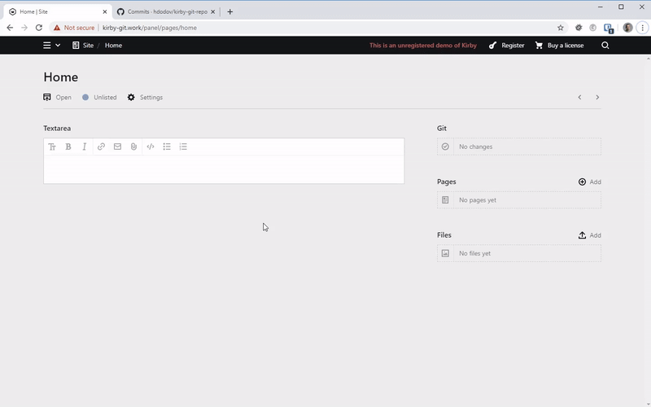
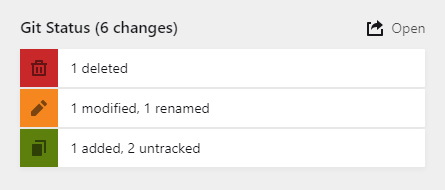
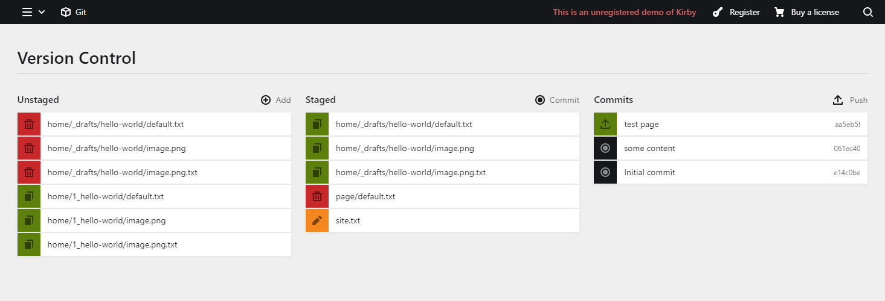

# Kirby Git

Shows you Git changes in the Kirby panel and allows you to add/commit/push them, manually or automatically.



# Installation

With [Composer](https://packagist.org/packages/oblik/kirby-git):

```
composer require oblik/kirby-git
```

**Note:** This plugin requires Git version `2.22.0` or above. Check how to update it on your server [here](https://unix.stackexchange.com/a/170831/405871).

# Usage

In order to work successfully with this plugin (and Git in general), you need separate branches in order to avoid overwriting history.

Let's say your repository is hosted on GitHub. This means you have a remote called `origin` and it points to that GitHub repo. Example setup:

- `live` is the branch that is checked out on the live server. Content changes are pushed to `origin/live` from the panel via this plugin. You should **never** push to `origin/live` by other means. This would allow editors to always be able to commit and push new changes.
- `dev` is the branch where you do development work locally on your machine. You can freely make both site changes _and_ content changes and push them to `origin/dev` for other developers to pull.
- `master` is where you merge the other two branches. You pull content changes from `origin/live`, merge them with your local changes on `dev`, resolve conflicts _locally_, and push to `origin/master`.

Whenever someone in the panel issues a pull, the `origin/master` branch will be fetched and merged with the local `live` on the server **if, and only if** a [fast-forward](https://git-scm.com/docs/git-merge#Documentation/git-merge.txt---ff-only) merge is possible. This means that if there are changes on `live` that are not reflected on `origin/master`, the merge will fail.

Example flow:

1. You push C1 (commit 1) and C2 from your `dev` to `origin/dev`
1. Editors push C3 and C4 from `live` to `origin/live`
1. You pull C3 and C4 from `origin/live` to your local `live`
1. You merge your `master` with your `dev` and your `live`, resulting in a merge commit C5
1. Your `master` now has all C1, C2, C3, and C4 and you push it to `origin/master`
1. Editors will be able to pull `origin/master` and fast-forward to C5, which has your C1 and C2

If editors created a new commit C6 on their `live` **before** merging with `origin/master`, the merge would have failed because C6 does not yet exist on `origin/master`. So they push C6 to `origin/live`, you pull it, merge it with `master`, and push it to `origin/master`. After that, editors would be able to pull.

## Config

The plugin expects a repo to already be initialized and set up. You just give a path to that repo and check out the branch it should use.

Options for the plugin are specified with dot notation in `site/config/config.php`. For example:

```php
return [
    'oblik.git.repo' => '/path/to/repo',
    'oblik.git.merge' => 'master',
    ...
];
```

### repo

Path to a folder containing a Git repo (a `.git` folder).

**Default:** `kirby()->root('index')` (the project folder)

### remote

What remote to use for pulling from and pushing to remote branches.

**Default:** `origin`

### merge

What branch to be used for merging when issuing a pull.

**Default:** `master`

### hooks

An array of [Kirby hooks](https://getkirby.com/docs/reference/plugins/extensions/hooks) to use as a trigger for `git add` and `git commit`. Example:

```php
return [
    'oblik.git.hooks' => [
        'site.update:after',
        'page.update:after'
    ]
];
```

With the above config, a new commit will be created any time a page or the site object is updated. However, this could bloat your repository with hundreds (or even thousands) of commits. You could use a hook like [`user.login:after`](https://getkirby.com/docs/reference/plugins/hooks/user-login-after) that gets triggered more rarely.

**Default:** `null`

### log

Absolute path to a file where each command executed by this plugin will be logged. Example:

```php
return [
    'oblik.git.log' => '/path/to/kirby-git.log'
];
```

Logs will look like this:

```
git -C /var/www/site status -u --porcelain 2>&1
git -C /var/www/site rev-list --count master 2>&1
git -C /var/www/site log origin/master..master --format=%h 2>&1
git -C /var/www/site log master --pretty=format:"%h|%an|%ae|%ad|%s" --skip="0" --max-count="15" 2>&1
...
```

**Default:** `false`

## Section

For displaying a summary of Git changes, you could use the `git` section in a blueprint:

```yml
title: Page
sections:
  changes:
    type: git
    headline: Git Status
```



## View

In the panel view, you can add, commit, and push changes in a very simple manner. Just three columns and three buttons:



## REST API

The plugin uses Kirby's REST API to provide a means for the panel view to communicate with PHP. You can use it as well! Check the various routes [here](../lib/routes.php).

## API

You can work with Git via the [`Git`](../lib/Git.php) class as well. For example:

```php
use Oblik\KirbyGit\Git;

$git = new Git();
$git->add();
$git->commit('my message');
$git->push();
```
